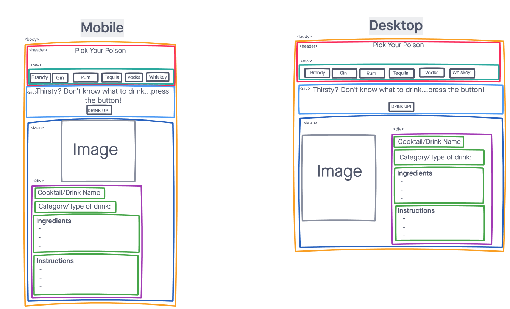

# **Pick Your Poison**

 A simple website meant to be a fun way for users to find out information about all different types of cocktails/shots/drinks. Users will be able to learn about different spirits, different combinations, ingredients, instructions on how to make them, and learn more about all different of cocktails.

## Technologies Used:
- HTML
- CSS
- JavaScript
- jQuery
- Google Fonts
- The Cocktail API

## Screenshots:
These screenshots show a quick sketch of what the app look on mobile and desktop.

## Getting Started:
[Click here](https://pick-your-poison1-92ye9cdrn-xcarrillo1.vercel.app/) to check the app out!

## Future Enhacements:
- The ability to favorite your favorite drinks and save to localstorage.
